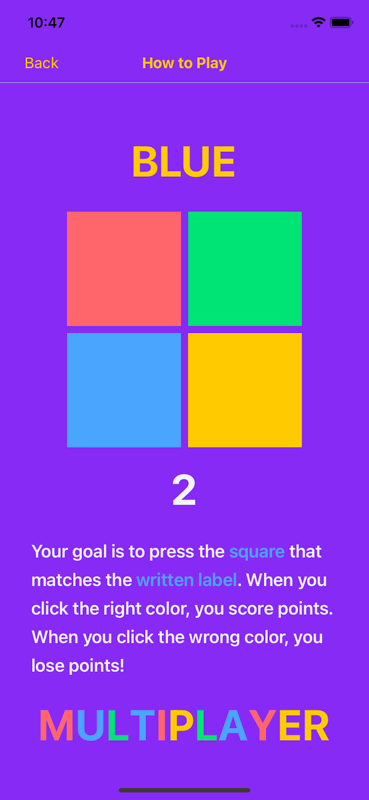
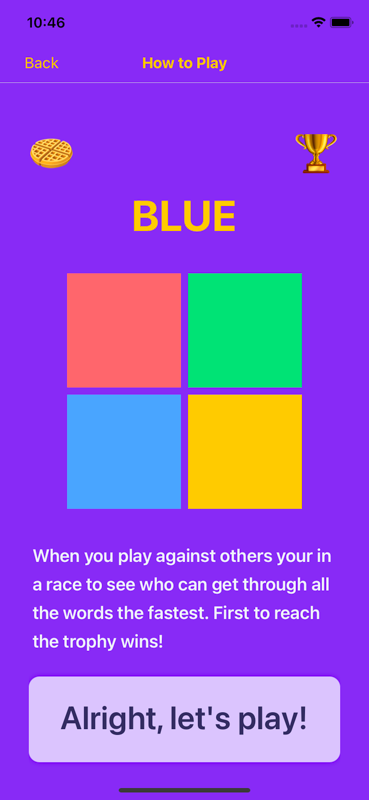

# [Stroopwafel](https://stroopwafel.app)
Stroopwafel is a casual multiplayer brain game made with React Native and Instant. This repo demonstrates how to use [InstantDB](https://instantdb.com) to add real-time and multiplayer features to your apps. If you’re curious, [check out this essay](https://www.instantdb.com/essays/next_firebase) to learn more about “why Instant”.

You can see Stroopwafel [live in the app store](https://apps.apple.com/us/app/stroopwafel/id6470153525).




## Quickstart
If you haven't already, you'll need to [install Expo Go](https://docs.expo.dev/get-started/expo-go/).

After that go ahead and clone the repo and install the dependencies. From your terminal run

```
# Clone the repo
git clone ...

# change into the directory
cd ...

# Install dependencies
npm i
```

Now you'll need to log in and head over to your dashboard on [Instant](https://instantdb.com) and generate a new `APP_ID`. Open up `src/App.js` and replace the placeholder value with your new ID.

From there, you should be ready to load up dev! From the project root, run:
```
make dev
```

Huzzah!

## Building the project
If you want to try making a development build, we recommend you set up [Expo Application Services](https://docs.expo.dev/eas/).

Edit `app.json` and `eas.json` to configure your own credentials. We've left the configuration we used for Stroopwafel as a reference.

## Android
We tested on iOS only, but getting Stroopwafel working in the Play Store should be straightforward.

## Reference
Below is a non-exhaustive breakdown of each part of the app.

**App.js**

This is the root component of the app. Here we:

- Initialize Instant
- Create a user and persist them to Instant on first load
- Load up the rest of the app

**Navigator.js**

We use React-Navigation to manage navigating across all the screens in Stroopwafel. You can conceptually categorize each screen as follows:

- Main: This is the first screen we render when opening the app
- Single Player
    - Singleplayer — This is the actual game screen
    - GameOverSingleplayer — This is the game over screen for singleplayer
- Multiplayer
    - JoinRoom — Simple screen that prompts users for a room code to join a lobby
    - WaitingRoom — This is the lobby screen before a game begins
    - Multiplayer — This is the game screen for multiplayer
    - GameOverMultiplayer — This is the game over screen for multiplayer
- Misc
    - HowToPlay — This screen explains how to play Stroopwafel
    - Settings — Another simple screen, allows users to change their handles.

**Components/scenes**

This is the meat and potatoes of the app. You’ll notice most of the code is front-end focused. Querying and mutating data is done through Instant and is very light-weight. Look through these components to see different examples of [InstaQL](https://docs.instantdb.com/docs/instaql) and [InstaML](https://docs.instantdb.com/docs/instaml).

Here’s the data model for the app:

```
users {
  handle: string,
  highScore: int,
  created_at: string,
}

rooms {
  code: string?,
  currentGameId: uuid,
  readyIds: [uuid],
  kickedIds: [uuid],
  hostId: uuid,
  created_at: string,
  deleted_at: string,
  :has_many users
}

games {
  status: "IN_PROGRESS" | "COMPLETED",
  colors: [[text: string, color: string]]
  playerIds: [uuid],
  created_at: string,
  :belongs_to rooms
}

points {
  userId: uuid,
  val: int,
  :belongs_to games
}
```

Some components of note:

- Main.js — Shows how to create a new room and associate it with a user.
- GameOverSingleplayer.js — Shows how to update a user’s high score
- WaitingRoom.js — Shows how to update multiple models in one transaction. Also shows how to fetch a specific model and a relation with `useQuery`
- Multiplayer.js — Shows how to fetch multiple relations for a namespace. Also shows how to easily update users' scores. What’s especially nice about this is you can just update a user’s score, and Instant takes care of updating everyone else through the power of `useQuery`

## Say hello!
Do you want to build your own apps with Instant? If so, hopefully this repo has been helpful for you! We love hearing feedback and what folks want to build. Come say hello  [on our discord!](https://discord.gg/VU53p7uQcE)
